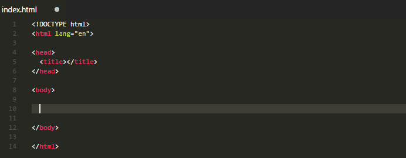

# Placeholder Images for Visual Studio Code

Generate and insert placeholder images into your HTML in Visual Studio Code using various 3rd party services like Unsplash, placehold.it, LoremFlickr and more.

## Placeholder services supported
- [DummyImage.com](https://dummyimage.com/)
- [Fake Images Please](https://fakeimg.pl)
- [LoremFlickr](http://loremflickr.com)
- [LoremPixel](http://lorempixel.com)
- [Pipsum](http://pipsum.com)
- [Placehold.it](http://placehold.it)
- [Placekitten](http://placekitten.com)
- [Placeskull](http://placeskull.com)
- [Unsplash](https://unsplash.it/)
- [Placecircle](https://elouwerse.nl/placecircle/)

## Features
- Choose image width, height, text, colors and more
- Insert generated `` tag into your HTML or copy it to the clipboard
- Insert the image url into your HTML, copy to clipboard or open it in your browser

## Examples

https://unsplash.it/200/100

http://placehold.it/250x120?text=hello+world

http://placeskull.com/170/170

http://lorempixel.com/200/300/sports/foobar

https://elouwerse.nl/placecircle/200

## Visual Studio Code Commands

### `Placeholder Images: Insert new image`

- Choose a placeholder image service and specify image width, height, etc to generate a new placeholder image

### `Placeholder Images: Recent images`

- Choose from a list of your most recently used placeholder images

## Settings

### `placeholderImages.quoteStyle`

- Quote style for HTML tags. Possible values are `single` or `double`
- Default: `single`

### `placeholderImages.maxRecentImages`

- The maximum number of image urls to save for the Recent images list
- Default: `10`

> Disclaimer: This extension is not affiliated with any of the specified 3rd-party placeholder image services.